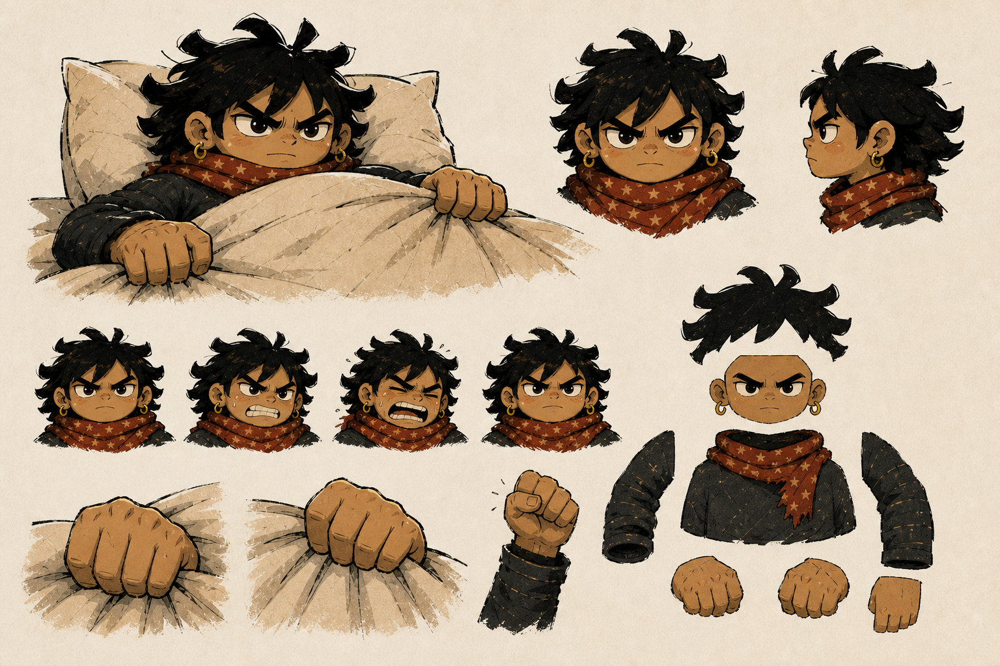
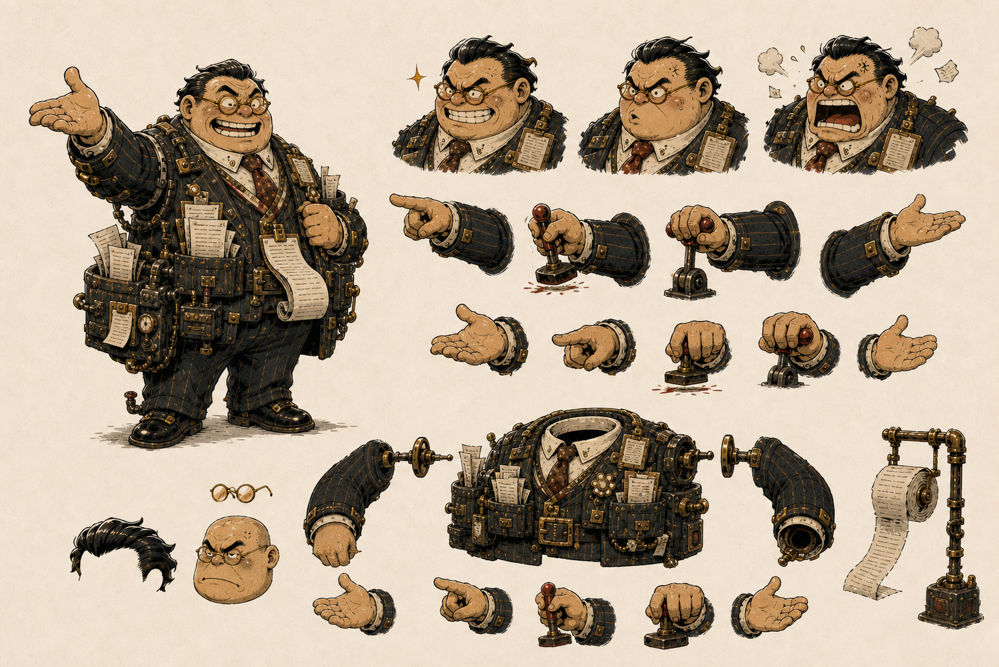

# First playable character production sheets

## Status and purpose

These sheets are maintainer-accepted first-draft production identities for the playable
confrontation in **The Alarm**. They enact the layer and state requirements in
[The Alarm playable-scene production
specification](the-alarm-playable-scene-production-spec.md). They are preserved
for maintainer review and are not production-approved, catalogued runtime
assets or a substitute for deliberately separated transparent parts.

The separated character parts described here are retained as development material in [first-playable layered parts](first-playable-layered-parts/README.md) and are not catalogued runtime assets; only the whole-figure Management rest and lifting poses ship.

## Protagonist



### Provenance

- Generated: 14 August 2026
- Tool: OpenAI built-in image generation (`gpt-image-2`)
- References: fifth production concept sheet and integrated Monday Uprising
  briefing illustration
- Human edits: none; first selected output
- Intended use: identity, expression, silhouette and cut-out planning
- Replacement status: derive deliberately separated, human-refined runtime
parts; the maintainer accepted this identity and sheet on 14 August 2026

### Prompt

```text
Use case: stylized-concept
Asset type: first-draft production character and cut-out planning sheet for the playable protagonist in The Alarm, a 2D political-satire rhythm game
Input images: Image 1 is the accepted fifth concept sheet and Image 2 is the accepted integrated campaign-briefing illustration; preserve the same original protagonist identity and visual language while making a new production sheet
Primary request: create a clean, coherent protagonist production sheet showing one definitive gender-ambiguous dark-haired hero designed for limited cut-out animation. Include: a large three-quarter gameplay pose lying low and gripping a duvet edge; front and side head studies; four expression studies progressing from calm defiance through effort and strain to undiminished fierce defiance; two large expressive duvet-gripping hand studies; one raised-fist victory hand; and an exploded cut-out planning view separating hair silhouette, face base, scarf-and-torso mass, near sleeve/arm, far sleeve/arm, and hands with generous clear space between parts
Character invariants: heroic, purposeful, compact and monumental despite remaining in bed; strong gaze; broad stable horizontal silhouette; prominent expressive hands; messy asymmetric black hair; muted red patterned scarf; dark practical clothing; warm human presence; gender ambiguity; no vulnerability or generic superhero anatomy
Style/medium: original editorial political-cartoon character design with bold rough charcoal contours, deliberately imperfect cut-paper shapes, dry printed texture and restrained cream, charcoal, brown and muted-red palette; slightly simplified from the narrative illustration so silhouettes survive gameplay scale
Composition/framing: organised visual sheet on plain warm paper, each study fully visible and non-overlapping, no environmental scene, no decorative border; cut-out planning parts should be legible as separate production shapes rather than anatomical gore
Constraints: character only; consistent proportions and identity across every study; hands and face readable small; no embedded story copy because documentation will carry labels separately
Avoid: all text, letters, numbers, labels, logos, signature, watermark, photorealism, glossy 3D, named-artist imitation, celebrity or existing-character likeness, strongly gendered body cues, childlike helplessness, 1950s adventure-book styling, pin-up pose, military uniform, cape, weapon, fear, tears, exposed anatomy or duplicated limbs within a single pose
```

### Initial source-level observations

- The low gameplay pose preserves the bed as a defended horizontal position.
- Hair, scarf, face and compact body remain coherent across the studies and do
  not introduce strongly gendered body cues.
- Oversized gripping hands give effort and conviction clear silhouettes.
- The expression ladder changes exertion without turning strain into fear.
- The exploded view gives a plausible first cut-out boundary for hair, face,
  torso, sleeves and hands.
- Runtime derivation still needs consistent transparent bounds, joint overlap,
  authored pivots and repainting where generated edges meet.

## Management



### Provenance

- Generated: 14 August 2026
- Tool: OpenAI built-in image generation (`gpt-image-2`)
- References: fifth production concept sheet and integrated Monday Uprising
  briefing illustration
- Human edits: none; first selected output
- Intended use: identity, emotional escalation, gesture and cut-out planning
- Replacement status: derive deliberately separated, human-refined runtime
parts; the maintainer accepted this identity, including the orientation expression, on 14 August 2026

### Prompt

```text
Use case: stylized-concept
Asset type: first-draft production character and cut-out planning sheet for Management in The Alarm, a 2D political-satire rhythm game
Input images: Image 1 is the accepted fifth concept sheet and Image 2 is the accepted integrated campaign-briefing illustration; preserve the same original fictional corporate grotesque and visual language while making a new production sheet
Primary request: create a clean, coherent Management production sheet showing one definitive recurring fictional embodiment of managerial capitalism designed for limited cut-out animation. Include: one large three-quarter orientation pose performing fake professional welcome while visibly brittle; three head-and-shoulder emotion studies progressing from performed cheer through wounded irritation to comic administrative rage; separate pointing, stamping, lever-pulling and false-presentation arm-and-hand gesture studies; and an exploded cut-out planning view separating hair, glasses, face base, overdressed receipt-filled torso, shoulder-pivoted arms, gesture hands and one receipt spool with generous clear space
Character invariants: pompous, entitled, spiritually small despite materially imposing apparatus; ridiculous first, unpleasant second, mildly threatening third; anger is wounded professional vanity at defiance; original fictional face with no politician coding; overdressed bureaucratic silhouette, too many pockets, badges, receipts and control fittings; strain and sweat under escalating loss of composure
Style/medium: original editorial political-cartoon character design with bold rough charcoal contours, imperfect cut-paper shapes, dry printed texture and restrained charcoal, brown, cream, management-gold and muted-red palette; simplified enough for clear gameplay silhouette and cut-out animation
Composition/framing: organised visual sheet on plain warm paper, studies fully visible and non-overlapping, no bedroom environment, no decorative border; parts should read as separate production shapes rather than anatomical gore
Constraints: consistent identity and proportions throughout; preserve the distinctive glasses, slick dark hair, brittle clenched smile and administrative apparatus; make humour arise from bureaucracy and overreaction rather than body size; no embedded copy
Avoid: all text, letters, numbers, labels, logos, signature, watermark, photorealism, glossy 3D, named-artist imitation, politician or celebrity likeness, orange skin, sharp teeth, demon or horror features, weapon, physical attack pose, body-size humiliation, uncomplicated jolly grin, triumphant confidence, military decoration, copied public figure or duplicated limbs within a single pose
```

### Initial source-level observations

- The sheet establishes the required orientation, irritation and rage ladder.
- Pointing, stamping, lever and false-presentation gestures have separable
  silhouettes suitable for shoulder-pivoted animation.
- Pockets, receipts and fittings make institutional excess—not resemblance to
  a politician—the recurring joke.
- The large orientation pose may still read as more genuinely cheerful than
  brittle; this requires maintainer judgement before runtime derivation.
- The torso remains materially bulky, so later refinement must ensure humour
  continues to come from bureaucracy, entitlement and overreaction rather than
  body size.
- Runtime derivation still needs coherent joint overlaps, transparent bounds,
  authored pivots and a simplified apparatus that remains readable beside the
  rhythm interface.

## Decision gate

On 14 August 2026 the maintainer explicitly accepted both sheets, rejected the
reservation that Management's orientation expression was too genuinely
cheerful, and requested derivation into runtime assets. That acceptance covers:

1. protagonist identity, gender ambiguity, heroic mass and expression ladder;
2. Management identity, default orientation expression and escalation ladder;
3. the relative proportions of protagonist, Management and bed; and
4. the proposed cut-out boundaries and gesture inventory.

It establishes the first-draft character identities and authorises runtime
derivation. It does not by itself mark the derived assets production-approved;
their transparent edges, pivots, integration and motion still require review.

## Runtime derivation

The accepted sheets were converted into episode-owned cut-out sources on 14
August 2026. For each sheet, the built-in image-generation tool replaced only
the paper field with a flat chroma background. The project image helper then
removed that field with a soft matte and despill; named parts were cropped from
the resulting transparent atlas without resizing. The chroma sources are
preserved under `production/sources/`, and every runtime crop is registered in
the presentation asset catalogue with its derivation and replacement status.

The extraction prompts required the accepted identities, positions, shapes,
textures and expressions to remain unchanged while only the background became
a uniform `#00ff00` field. The protagonist prompt explicitly preserved gender
ambiguity and every exploded-view part. The Management prompt explicitly
preserved the maintainer-accepted orientation expression and gesture inventory.

The first browser assembly composed the protagonist from torso, face, hair,
two sleeves and two duvet-overlay grip hands, and Management from torso, head,
two arms and receipt apparatus. Runtime review showed that the exploded-view
parts were valid animation planning material but did not form convincing
default poses: joints, overlaps and cropping made both figures look detached.

The dedicated composition pass therefore derived two additional coherent
episode-owned assets from the accepted sheets:

- `protagonist-gameplay-pose` keeps the complete head, scarf, shoulders, arms
  and hands connected around one duvet grip; and
- `management-gameplay-pose` keeps the complete figure and bureaucratic
  apparatus connected around one accusatory pointing pose.

Their chroma sources are preserved as
`production/sources/protagonist-gameplay-pose-chroma.png` and
`production/sources/management-gameplay-pose-chroma.png`. Both were generated
with the built-in OpenAI image-generation tool on 14 August 2026 using their
accepted production sheets as identity references, then processed with the
project chroma-removal helper using a soft matte and despill. The exact compact
prompts and edits are recorded in the asset catalogue.

The episode skin uses these coherent poses for the default confrontation while
retaining every separated crop for later authored animation states. The
generic composition contract accepts either a semantic whole `figure` or its
documented articulated parts. This is a first-draft refinement, not production
approval; integrated scale, edge quality, motion and perceptual character
acceptance remain review items.

## Management action-state correction

Runtime review established two further requirements: Management must visibly
cause the bed lift rather than merely point while it happens, and exertion
sweat must never appear at rest. Two coherent state assets enact that decision:

- `management-rest-pose` shows brittle composure with one hand resting on an
  idle brass lifting lever and contains no sweat or strain marks; and
- `management-lifting-pose` shows both hands hauling the displaced lever, a
  braced stance, clenched comic fury and clearly readable perspiration.

Their chroma sources are preserved as
`production/sources/management-rest-pose-chroma.png` and
`production/sources/management-lifting-pose-chroma.png`. Both were generated
with the built-in OpenAI image-generation tool on 14 August 2026, using the
accepted Management sheet as the identity reference and the rest pose as the
lifting pose's apparatus-and-proportion reference. Chroma removal used a soft
matte and despill; complete prompts and edits are recorded in the asset
catalogue.

State selection is authored, not hard-coded for **The Alarm**. The episode skin
provides ordered dramatic-intensity thresholds and maps semantic Management part IDs to
catalogue asset IDs. Generic validation requires the thresholds to begin at
zero and increase, rejects duplicate or unknown part IDs and non-image targets,
and enforces normal asset ownership. The generic renderer selects the highest
eligible state. It contains no knowledge of this campaign, this episode,
levers or sweat.

## Protagonist perspective and downhill cloth

Browser review then showed that rotating the resting protagonist as a rigid
sticker did not describe the changing bed plane. Two attempts to solve that
with a replacement protagonist-and-cloth cut-out also failed: even the more
side-on figure retained a perspective system incompatible with the separately
generated frame, mattress and duvet.

The first danger candidate was rejected during browser review because it put a
face-on upright torso behind a diagonal duvet rather than reclining the body on
the bed plane. A second, more side-on candidate was generated from the accepted
identity sheet, coherent resting pose and forced-verticalisation illustration,
but still used a perspective system incompatible with the separately generated
bed. Both rejected image files and their unused catalogue entry were removed
before the art commit; this decision record preserves why they must not be
reintroduced.

Neither candidate was selected by the episode skin. The
replacement direction is a set of complete authored resistance compositions: frame,
mattress, pillows, duvet and protagonist composed together at rest, early lift,
high danger and near verticalisation. A full-scene comparison sheet must first
establish those shared planes and the relative scale and mechanical connection
of a much larger Management figure. The maintainer subsequently accepted the
corrected v5 resistance-state sheet, and its registered runtime derivation and generic
limited-animation transition are recorded in [The Alarm resistance-state
sheet](the-alarm-resistance-state-sheet.md).
