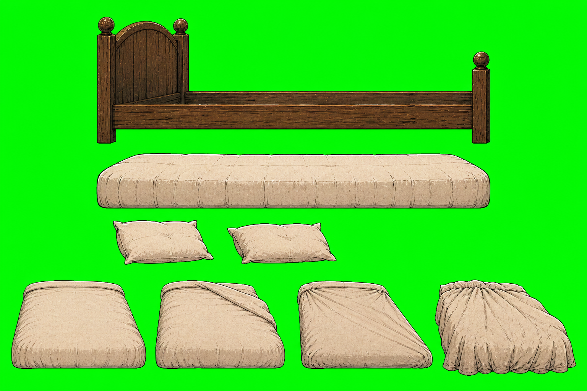
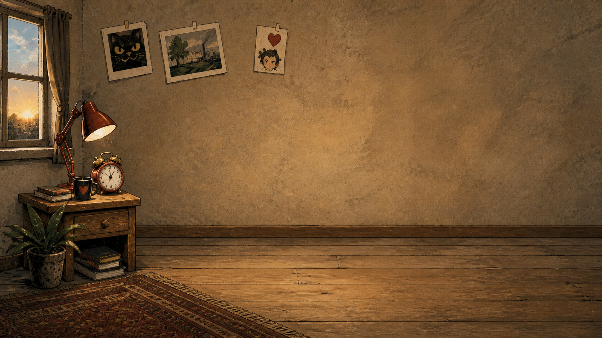
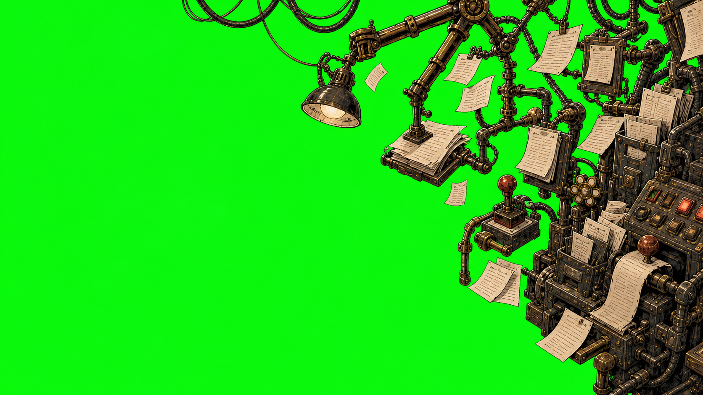

# First playable bed, duvet and environment assets

## Scope and status

These assets are the first intended enactment of the art direction for **The
Alarm**, in **The Monday Uprising**. They do not prescribe the direction of
later episodes or campaigns: contributors may propose different enactments
through the project's normal community process.

The separated bed, pillow and duvet-state parts described here are retained as development material in [first-playable layered parts](first-playable-layered-parts/README.md) and are not catalogued runtime assets; the bedroom base, office incursion and whole bed tableaux ship in their place.

All assets below are first-draft, AI-assisted production hypotheses. They are
catalogued as `prototype-placeholder` until their composition, cut-out edges,
human refinement and perceptual quality have been explicitly accepted. The
runtime uses stable catalogue IDs selected by the episode-owned skin; it does
not contain episode-specific file paths or TypeScript branches.

## Bed and duvet source atlas

- Generated: 14 August 2026
- Tool: OpenAI built-in image generation (`gpt-image-2`)
- Prompt: “Create an original cut-out production atlas for The Alarm: isolated
  wooden bed frame, mattress, two pillows and four cream-duvet tension states,
  matching the approved editorial political-cartoon linework, cut-paper shapes,
  dry print texture and warm restrained palette; flat #00ff00 background; no
  characters, text, logos, signatures, watermarks or photorealism.”
- Edits: local chroma removal, despill and component crops without resizing.
  These early cut-out components are retained with their provenance but were
  superseded in the playable episode by the authored
  `confrontation.resistance` state sequence.
- Runtime IDs: `bed-frame`, `bed-mattress`, `pillow-near`, `pillow-far`,
  `duvet-rest`, `duvet-tension-low`, `duvet-tension-high` and
  `duvet-forced-verticalisation`.

The four duvet silhouettes were discrete authored hypotheses rather than
procedural cloth deformation. They are not selected by the current episode
skin.

## Empty bedroom

- Generated: 14 August 2026
- Tool: OpenAI built-in image generation (`gpt-image-2`)
- Prompt: “Create the empty 16:9 bedroom background for The Alarm in the
  approved original editorial political-cartoon style: warm dawn room, inked
  linework, cut-paper shapes and dry print texture; reserve the centre and lower
  field for the runtime bed and struggle, bedside props to the left, no bed,
  duvet, characters, office machinery, text, logos, signatures or watermarks.”
- Edits: copied without cropping into the episode-owned runtime directory.
- Runtime ID: `bedroom-base`.

## Office incursion

- Generated: 14 August 2026
- Tool: OpenAI built-in image generation (`gpt-image-2`)
- Prompt: “Create a transparent-ready office-incursion overlay for The Alarm:
  grotesque corporate machinery, fluorescent fittings, filing cabinets,
  cables, receipts and levers pressing in from the rightmost third, compatible
  with the approved editorial cartoon bedroom; irregular left edge and flat
  #00ff00 elsewhere; no characters, bed, text, logos, signatures, watermarks or
  photorealism.”
- Edits: local chroma removal and despill; full 16:9 alignment preserved.
- Runtime ID: `office-incursion`.

The generic renderer interpolates the overlay's alpha and horizontal offset
from validated skin values. It coexists with the domestic room instead of
replacing it, so escalation depicts Management invading an inhabited space.

## Review boundary

Before production approval, inspect the integrated scene for physical bed and
duvet attachment, protagonist and Management scale, protected gameplay space,
green spill, accidental marks, recognisable likenesses, and clarity at desktop
and supported landscape-mobile sizes. The original prompts and chroma sources
are retained here so later contributors can audit and replace the derivation.
