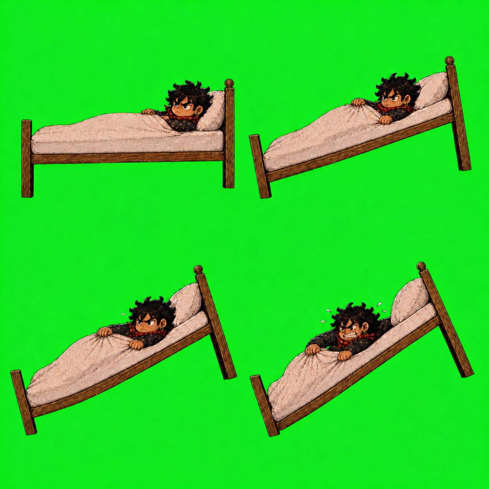

# The Alarm resistance-state sheet

## Status and purpose

This sheet is the maintainer-accepted first-draft resistance-state direction for **The
Alarm** in **The Monday Uprising**. It does not prescribe how later episodes or
campaigns must compose their characters. Its purpose is to enact one narrow
decision: the bed frame, mattress, pillows, duvet and protagonist are authored
together as a coherent resistance composition at each important lift state rather than
assembled from independently generated perspective systems.

The corrected four panels explore rest, early lift, high danger and near
verticalisation. Every panel attempts to preserve the left bed foot as a fixed
pivot, keep the protagonist physically embedded in the mattress and duvet, and
show Management's connected lever as the cause of the lift. Management is
deliberately large and imposing at the right edge, while remaining a comic
bureaucratic grotesque.

The first sheet,
`concepts/the-alarm-resistance-state-sheet-v1.png`, is preserved but rejected.
It allowed a pillow and head-like bedding mass to appear at the left foot and
therefore violated the prototype's basic bed topology.

The second sheet,
`concepts/the-alarm-resistance-state-sheet-v2-prototype-topology.png`, corrected
that topology and established the intended full-scene relationship: large
Management at the right, one pillow and the headboard at the right, and the
fixed foot pivot at the left. It remains the contextual composition reference.

The third sheet shown above isolates the resistance composition layer on a removable
chroma field. It contains no Management, lever, room, furniture, office
incursion or lighting, because those remain independent runtime layers. Its
rest panel also establishes a strict shared rest invariant: the protagonist is
settled and dry-faced, with no sweat, strain marks or effort pose. Management's
separate rest state follows the same no-sweat rule.

The fourth sheet,
`concepts/the-alarm-resistance-state-sheet-v4-regularised-posts.png`, is a
targeted edit of v3. It preserves the characters, bedding and state progression
while regularising the two wooden posts: constant lengths and thicknesses,
consistent rail attachment, and rotation as rigid members of the bed. The left
foot post therefore leans with the tilted bed around its hinge rather than
remaining vertical or stretching toward the floor. Exact runtime geometry will
still reuse one canonical bed rather than depend on generative registration.

The fifth and current sheet,
`concepts/the-alarm-resistance-state-sheet-v5-plain-foot-posts.png`, removes
the circular metal hinge plates beneath the left foot posts. Those details were
intended to explain the lifting pivot but read as unexplained wheels or balls.
The foot posts now end as ordinary squared wooden bed legs; the changing bed
angle alone communicates the lift.

## Generation record

- Generated: 14 August 2026
- Tool: OpenAI built-in image generation (`gpt-image-2`)
- References: the actual prototype-game screenshot as the absolute authority
  for bed topology and camera orientation; accepted protagonist and Management
  production sheets; accepted forced-verticalisation debrief illustration.
- Edits: each sheet copied without alteration into the concept archive.
- Runtime status: four registered derivatives are catalogued and selected by
  the episode-owned presentation skin. The maintainer accepted the bed animation
  in play on 16 August 2026 and they are catalogued `production-approved`.
  They depict the protagonist and were therefore approved as identity-critical
  work without a human repainting pass, a deliberate decision recorded on
  issue #22 and published as a known limitation on issue #21.

The corrected production prompt requested one fixed-camera 2×2 sheet containing
four successive full-scene states. It repeatedly fixed the prototype map:
short footboard and floor pivot on the left; tall headboard, the one and only
pillow and protagonist's head on the right; no mirroring, second pillow or
pillow migration. It required frame, mattress, pillow, duvet and protagonist to
share one contact plane in every panel; made Management nearly the full usable panel height;
specified no sweat at rest and progressively greater lever effort and sweat;
kept the lower-centre control corridor quiet; preserved the accepted fictional
identities and editorial print texture; and prohibited a face-on protagonist
behind a diagonal duvet, small peripheral Management, disconnected mechanisms,
real-person likenesses, text, logos and watermarks.

## Initial observations

- The bed, bedding and protagonist read as one physical object in each
  panel rather than overlapping cut-outs.
- The left-foot/right-head topology now follows the prototype, with one pillow
  retained at the right head end throughout.
- Management has the agreed visual weight and visibly operates the mechanism.
- The rest-to-effort expression and sweat distinction is legible.
- The isolated sheet cleanly separates bed-state artwork from environmental
  lighting, furniture and office incursion.
- The isolated rest protagonist contains no sweat or strain; perspiration
  appears only after lift and effort begin.
- The lift progression is materially closer to gameplay than rejected v1,
  though exact registration and authored angles still require a controlled
  production pass.
- The fixed pivot and exact camera/framing are directionally consistent but not
  precise enough to derive registered animation frames without a further
  controlled production pass.

## Runtime derivation and transition decision

On 15 August 2026 the accepted v5 sheet was derived deterministically rather
than regenerated. The green field was removed once with a soft matte and
despill. Each 627 by 627 quadrant was cropped without resizing, then placed
unchanged on a common transparent production canvas around one shared visible
foot-and-rail pivot. Browser review then showed that crossfading the four
already-tilted drawings still produced an obvious geometric snap. Each state
was therefore counter-rotated around that same pivot until its local bed rail
was horizontal, then preserved on a common 900 by 900 transparent canvas. The
four final assets live under
`src/play/content/presentation/assets/episodes/the-alarm/resistance-states/`.

“Bed resistance composition” is the episode's art-direction term. Runtime content exposes these
images through the reusable `confrontation.resistance` role; shared engine code does not
name or interpret the depicted furniture.

The episode skin selects rest, early lift, high danger and near verticalisation
through ordered physical-danger thresholds and semantic catalogue references.
Phaser now supplies one continuous bed rotation from rest to 34.1 degrees around
the registered foot pivot; elapsed-time smoothing with a 240 ms authored
response prevents stepped safety changes from snapping the angle. The threshold
images change only the authored protagonist and bedding state. The skin also
authors a deliberately cheap limited-animation transition: a 280 ms crossfade,
three-pixel jolt and two-pixel restrained shake. Phaser briefly keeps only the
outgoing and incoming images alive. When the operating system requests reduced
motion, the same generic renderer removes angular easing, jolt and shake and
uses an 80 ms crossfade. Thresholds, angle, response, timing and motion values
are content rather than episode-specific TypeScript.

The maintainer accepted the complete resistance-state approach, four-state progression
and short crossfade/jolt/shake vocabulary before integration. Runtime scale,
state-to-state registration, Management coordination and the bedroom-to-office
transformation still require perceptual review in the actual game.
