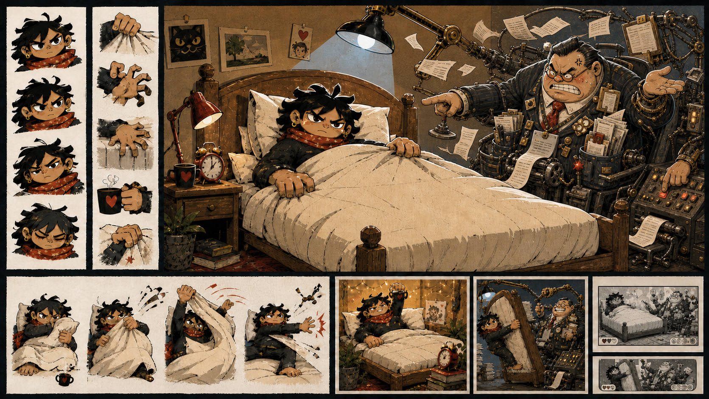

# Fifth production concept sheet: angry Management

Status: exploratory visual research; not production-approved or integrated



## Purpose

This fifth sheet edits the [comic Management concept](fourth-production-concept-sheet.md)
to test whether wounded vanity and anger at the player's defiance can add threat
without returning to horror. The protagonist, room and overall composition are
held as invariants.

## Provenance

- Generated: 14 August 2026
- Tool: OpenAI built-in image generation
- Input reference: `../art/concepts/the-monday-uprising-concept-sheet-v4-comic-management.png`
- Source image: `../art/concepts/the-monday-uprising-concept-sheet-v5-angry-management.png`
- Origin: AI-generated exploratory edit
- Production status: not approved
- Human edits: none; first unedited output from the angry-Management iteration
- Intended next step: maintainer comparison with the fourth sheet

## Prompt

```text
Use case: precise-object-edit
Asset type: fifth exploratory concept sheet for a 2D political-satire rhythm game; visual research only
Input images: Image 1 is the exact edit target.
Primary request: Change only Management’s emotional expression, gesture and the agitation of its immediate machinery. Management should be visibly angry at the heroic defiance in front of it, while remaining a pompous figure of fun rather than becoming scary, violent or horrific.
Preserve exactly: the protagonist in every panel, including face, gender ambiguity, hair, scarf, body, hands, poses and expressions; the bed, duvet, bedroom, concept-sheet layout, palette, rendering, lighting, administrative apparatus design, forced-verticalisation staging and all crop thumbnails.
Management expression: replace the uncomplicated enormous cheerful grin with a brittle professional smile that is visibly failing. The smile should be clenched and asymmetrical rather than toothy-happy; no sharp teeth. Narrow the petty eyes toward the protagonist, furrow the brow, redden the cheeks slightly with frustrated indignation, and show one small stress twitch. Management is affronted that anyone would disobey. The emotion is wounded vanity, petulance and corporate rage—not predatory hatred.
Management pose: one hand stamps paperwork much too hard, one points accusingly at the bed, one angrily mashes an overcomplicated control panel, while another still attempts a fake presentation gesture. The body strains to maintain professional composure. The tiny office chair skews slightly under the agitation.
Apparatus reaction: receipts spool too fast, papers fly, one cable tangles around Management’s sleeve, an indicator flashes, and a presentation device tilts out of alignment. Keep this controlled and readable rather than adding new dense machinery.
Tone: funny first, unpleasant second, mildly threatening third. The joke is that Management interprets a person remaining in bed as an intolerable personal and institutional insult.
Style/medium: preserve Image 1’s bold graphic political-cartoon rendering, cut-paper texture, rough ink contours and limited palette.
Constraints: only edit Management and its directly attached apparatus; maintain one recurring systemic capitalist grotesque; preserve small-size readability and cut-out layer plausibility.
Avoid: no happy open grin, no giant horror mouth, no sharp teeth, no skull or demonic features, no physical attack pose, no weapon, no politician or celebrity likeness, no orange skin, no body-size joke, no humiliation or restraint of the protagonist, no alteration to the protagonist, no generated labels, logos, brands, slogans, signature or watermark.
```

## Initial source-level observations

This draft successfully:

- makes Management's anger a reaction to visible defiance rather than a generic
  monster expression;
- replaces uncomplicated cheer with clenched teeth, sweat, narrowed eyes and
  wounded professional vanity;
- generates comedy through disproportionate overreaction, accusatory pointing,
  flying paperwork and loss of administrative control;
- keeps the threat in the control machinery and institutional power; and
- preserves the preferred protagonist and bedroom composition.

Unresolved choices remain:

- the brittle failing smile requested by the prompt has become an almost total
  tantrum, so Management may have lost too much fake professional composure;
- clenched teeth and direct pointing add useful anger but could become visually
  repetitive if used as the default pose rather than an escalation state;
- the body-size stereotype identified in the fourth sheet remains unresolved;
- the quantity of paperwork around the face slightly reduces silhouette
  clarity; and
- the strongest production direction may require multiple Management states:
  performed cheer at orientation, irritation under resistance and comic rage at
  crisis, rather than one expression serving the whole episode.

These are source observations awaiting human comparison, not perceptual
acceptance.
