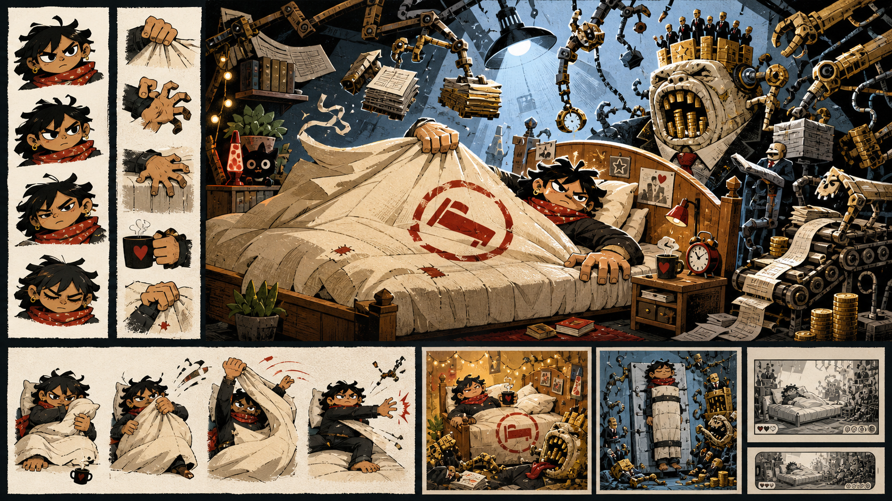

# First production concept sheet

Status: exploratory visual research; not production-approved or integrated



## Purpose

This first concept sheet tests the asset hypotheses in [Political satire and
radical print art direction](political-satire-art-direction.md) for **The Monday
Uprising** and **The Alarm**. It is not a game asset, a final character design or
evidence of human perceptual acceptance.

## Provenance

- Generated: 14 August 2026
- Tool: OpenAI built-in image generation
- Source image: `../art/concepts/the-monday-uprising-concept-sheet-v1.png`
- Origin: AI-generated exploratory research
- Production status: not approved
- Human edits: none; selected as the first unedited output for critical review
- Intended next step: maintainer review followed by a targeted second draft,
  not extraction of production layers

## Prompt

```text
Use case: stylized-concept
Asset type: exploratory concept sheet for a 2D political-satire rhythm game; visual research only, not a production game asset
Primary request: Create one cohesive landscape concept sheet for “The Monday Uprising”, first episode “The Alarm”. Show an original heroic, gender-ambiguous player actively defending their right to remain in bed against Management, a grotesque personification of capitalism at its worst.
Scene/backdrop: a warm, extremely comfortable bedroom treated as a defended horizontal stronghold; invasive office light, paperwork, executive machinery and acquisitive appendages enter from above and the right.
Subject: the player remains horizontal, broad, stable, purposeful and defiant—not timid, passive, helpless or conventionally muscular. Include a determined gaze, purposeful hands, a duvet-grip pose, a mattress-grip pose, and a sustained-resistance pose. Management is a wholly fictional systemic grotesque built from appetite, accumulation, hierarchy, coercion, sterile corporate polish, grasping anatomy and absurd machinery. It must not resemble or evoke any politician, celebrity or real person.
Style/medium: original colourful editorial-cartoon concept art with radical-print energy; rough ink contours, decisive silhouettes, deliberately imperfect cut-paper forms, selective restrained print texture, limited cut-out-animation logic. Do not imitate any particular artist or existing artwork.
Composition/framing: one clear 16:9 concept sheet. A dominant central gameplay composition with the head of the bed on the right; surrounding smaller pose studies for gaze and hands; one small victorious “bed held” outcome thumbnail; one small forced-verticalisation outcome thumbnail that preserves the player’s dignity and makes the system the joke; two tiny framing studies for desktop landscape and mobile landscape. Keep panels visually separated without relying on written labels.
Lighting/mood: warm solidarity and heroic comic defiance inside the bed; cold coercive work light around Management; funny, politically pointed, energetic, never nihilistic.
Color palette: duvet cream, ink charcoal, resistance red, work-light blue, management gold used for accumulation and executive spectacle, paper white. Important distinctions must also read by shape and value, not colour alone.
Materials/textures: rumpled soft bedding, rough paper and ink, hard sterile office surfaces, mechanical arms, files, cables and corporate apparatus.
Constraints: player is the moral and compositional hero; bed reads as barricade/rampart; duvet may move like a restrained banner while still clearly showing coverage and danger; strong readable silhouettes at small size; forms should look separable into layered cut-out parts with plausible pivots; original anatomy, costumes, props and visual jokes.
Avoid: no recognisable politician or public figure, no orange-skinned person, no signature hairstyle or politician costume, no logos, no brands, no flags, no copied symbols, no artist signature, no watermark, no imitation of named artists, no generic superhero costume, no glamourised billionaire, no photorealism, no illegible generated text, no humiliating or infantilised player.
```

## Initial source-level observations

The sheet usefully demonstrates:

- a broad horizontal protagonist with a clear gaze and active hands;
- the bed as a defended position rather than a passive refuge;
- a readable warm domestic and cold managerial opposition;
- Management expressed as accumulation, machinery, paperwork and hierarchy
  rather than a recognisable politician; and
- a graphic treatment that could inform separated cut-out layers.

It also introduces choices that were not requested or accepted:

- the protagonist reads younger than the brief settles and needs deliberate
  age review;
- the repeated red duvet emblem is an invented symbol and should not be retained
  without an explicit political and originality decision;
- Management reads primarily as an industrial monster, while the desired balance
  between executive grotesque, institution and machine remains open;
- repeated small suited figures may dilute the clarity of one recurring
  Management presence;
- the forced-verticalisation thumbnail risks reading as physical restraint,
  which may undermine the intended dignified, funny and sad outcome; and
- the sheet suggests layers but does not prove clean pivots, transparent bounds
  or animation compatibility.

These observations are prompts for human review, not perceptual acceptance.

## Comparative maintainer direction

After reviewing the quieter second sheet on 14 August 2026, the maintainer chose
this first sheet as the baseline for another iteration. Its more stylised,
gender-ambiguous hero and more forceful grotesque Management were strongly
preferred. The next draft should preserve those qualities while selectively
reducing spectacle, environmental density and mechanical clutter. This
preference does not mark the sheet or any extracted part production-approved.
