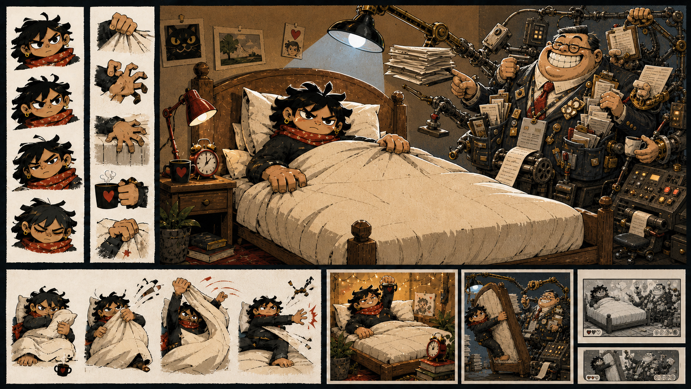

# Fourth production concept sheet: comic Management

Status: exploratory visual research; not production-approved or integrated



## Purpose

This fourth sheet edits the [moderated third concept sheet](third-production-concept-sheet.md)
to test a more comic recurring Management. It preserves the preferred
protagonist and bedroom while moving immediate threat from Management's face to
the bed-lifting and administrative machinery.

## Provenance

- Generated: 14 August 2026
- Tool: OpenAI built-in image generation
- Input reference: `../art/concepts/the-monday-uprising-concept-sheet-v3-moderated.png`
- Source image: `../art/concepts/the-monday-uprising-concept-sheet-v4-comic-management.png`
- Origin: AI-generated exploratory edit
- Production status: not approved
- Human edits: none; first unedited output from the comic-Management iteration
- Intended next step: maintainer comparison before any further iteration

## Prompt

```text
Use case: precise-object-edit
Asset type: fourth exploratory concept sheet for a 2D political-satire rhythm game; visual research only, not a production asset
Input images: Image 1 is the accepted baseline for this iteration. Preserve its concept-sheet layout, protagonist, bed, bedroom, pose studies, palette, graphic rendering, cut-paper texture, lighting balance and central composition as closely as possible.
Primary request: Redesign only Management and its immediate administrative apparatus so Management is a pompous figure of fun with an undertone of grotesque fear, not a horror monster. Also correct the forced-verticalisation thumbnail so the player is never tied, strapped or restrained.
Preserve exactly: the gender-ambiguous dark-haired protagonist’s face, scarf, bold proportions, heroic horizontal posture, gaze, hands and expressions; the plain cream duvet; the wooden bed with head on the right; the warm domestic bedroom; the sheet’s dramatic graphic editorial-cartoon treatment; all protagonist pose studies.
Management redesign: replace the crowned tooth-filled maw and skull-like horror face with one wholly original comic executive-administrative grotesque. At first glance Management should be vain, pompous, officious, self-satisfied and ridiculous. On closer inspection it should embody appetite, accumulation, hierarchy and coercion. Use an enormous professionally cheerful false smile without sharp teeth; petty anxious eyes; an immaculate but absurdly overdecorated corporate torso; too many pockets overflowing with contracts and bonuses; a tie that feeds uselessly into a receipt printer; several elegant mechanical hands pointing, stamping, seizing papers and operating a ludicrously complicated bed-lifting control panel; a tiny inadequate wheeled office chair beneath the apparatus; lanyards, meaningless badges and presentation devices with no readable text. Machinery should occasionally tangle around Management and undermine its dignity.
Threat design: genuine danger comes from one strong mechanical lifting arm attached to the bed, hard work light and coercive administrative machinery—not from a frightening face. Management should look capable of forcing the bed upright while personally remaining ridiculous and slightly out of control.
Emotional ratio: approximately 60 percent figure of fun, 25 percent grotesque excess, 15 percent genuine threat.
Outcome thumbnails: victory may show Management tangled in receipts or arguing with a presentation remote while the hero remains horizontal. Forced verticalisation must show the bed mechanically tipped upright and the dignified hero still actively gripping it; no straps, ropes, binding, cage or humiliation.
Style/medium: retain Image 1’s bold original political-cartoon rendering, strong graphic masses, rough ink contours, imperfect cut-paper edges and limited colour. Management must remain visually substantial and satirical, not become realistic, genteel or bland.
Constraints: change Management and its apparatus only, except for correcting the forced-verticalisation thumbnail. Keep one recurring Management presence. Make the central silhouette readable at small size and plausibly separable into cut-out layers.
Avoid: no crown, no giant maw, no sharp teeth, no skull face, no horror monster, no demonic features, no politician or celebrity likeness, no orange skin, no signature hairstyle, no body-size stereotype as the joke, no ordinary polite businessman, no army of executives, no logos, brands, slogans, readable generated text, artist signature or watermark; do not alter or feminise/masculinise the protagonist; do not make the protagonist realistic, childlike or generic; no restraint of the protagonist.
```

## Initial source-level observations

This draft successfully:

- preserves the preferred protagonist, bedroom and graphic treatment;
- makes Management vain, officious and ridiculous on first sight rather than
  frightening;
- carries coercive threat through the lifting apparatus and control machinery;
- uses pockets, stamps, contracts, receipts and presentation devices to embody
  administration and accumulation; and
- replaces the strapped forced-verticalisation image with a dignified player
  actively gripping the mechanically raised bed.

Unresolved choices remain:

- Management still leans heavily on the familiar large-businessman stereotype,
  despite the prompt's prohibition, so body size risks carrying the moral joke;
- the enormous grin may be too generically cartoonish to become a distinctive
  recurring expression;
- hair, glasses and suit remain close to conventional executive shorthand and
  need a more original combination;
- administrative detail is again dense enough to challenge small-screen
  silhouette clarity;
- the tiny chair, tangled machinery, receipt tie and proliferating pockets may
  be stronger recurring ideas than the current body; and
- the visual result does not yet prove clean cut-out layers or pivots.

These are source observations awaiting human comparison, not perceptual
acceptance.
