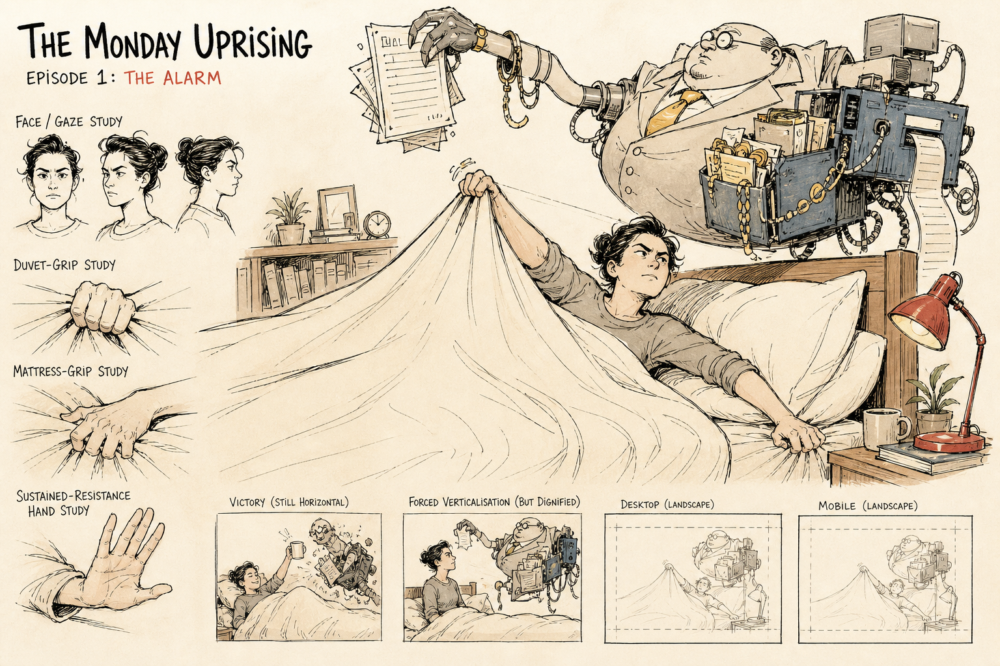

# Second production concept sheet: line-art comparison

Status: exploratory visual research; rejected as the production direction and
preserved for comparison



## Purpose

This second sheet deliberately tests a quieter alternative to the [first
production concept sheet](first-production-concept-sheet.md). It retains the
heroic horizontal composition and systemic Management while reducing cinematic
spectacle, rendering density, mechanical-monster scale and repeated executive
figures. The two sheets are preserved for comparison rather than treating the
second as an automatic replacement.

## Provenance

- Generated: 14 August 2026
- Tool: OpenAI built-in image generation
- Source image: `../art/concepts/the-monday-uprising-concept-sheet-v2-line-art.png`
- Origin: AI-generated exploratory research
- Production status: not approved
- Human edits: none; selected as the first unedited line-art comparison output
- Intended next step: compare both sheets through maintainer review before a
  targeted character or composition iteration

## Prompt

```text
Use case: stylized-concept
Asset type: second exploratory concept sheet for a 2D political-satire rhythm game; visual research for comparison with a more dramatic first sheet, not a production game asset
Primary request: Create a quiet, economical, line-led editorial-cartoon concept sheet for “The Monday Uprising”, first episode “The Alarm”. Show an original adult, gender-ambiguous, ordinary but unmistakably heroic player actively defending their right to remain in bed against one recurring figure called Management, a grotesque personification of capitalism at its worst.
Scene/backdrop: an inviting everyday bedroom with plenty of unmarked warm paper space. Management intrudes from above and the right with one absurd executive body merging sparingly into a lifting arm, paperwork, cables and modest office machinery. The room must still feel domestic and comfortable, not like an epic battlefield.
Subject: the player remains horizontal, broad, stable, composed, purposeful and defiant. Show a firm adult gaze, one clear duvet-grip study, one mattress-grip study and one sustained-resistance hand study. Management is one wholly fictional executive-capitalist grotesque built from appetite, accumulation, hierarchy, coercion, immaculate corporate surfaces, overfilled pockets, grasping anatomy and absurd administrative apparatus. No crowd of executives and no giant industrial monster.
Style/medium: original loose pen-and-ink editorial cartoon on warm off-white paper; expressive economical contour, varied line weight, selective dry-brush or imperfect print marks, sparse flat colour washes, visible paper, intentionally hand-drawn. Satirical newspaper illustration rather than cinematic game concept art. Do not imitate any particular artist or existing artwork.
Composition/framing: one clear landscape concept sheet with a dominant simple bedroom confrontation occupying roughly two thirds of the page. Surround it with a few airy studies: adult face/gaze, purposeful hands, a tiny victory thumbnail, a tiny forced-verticalisation thumbnail preserving dignity, and two simple crop boxes for desktop landscape and mobile landscape. No decorative panel overload. The head of the bed is on the right. One instantly readable central joke.
Lighting/mood: warm, wry, defiant, politically pointed and funny; danger remains clear but not apocalyptic.
Color palette: mostly ink charcoal and paper white, with restrained flat accents of duvet cream, resistance red, work-light blue and management gold. No fully painted rendering. Shape and value carry meaning without colour.
Materials/textures: soft rumpled bedding drawn with economical lines; hard clean office geometry; minimal paper, filing and cable details; no dense steampunk texture.
Constraints: player is the moral and compositional hero; the bed reads as a defended horizontal position; duvet may gently suggest a banner but remains plain and clearly reports coverage; strong small-size silhouettes; visual parts should appear separable for limited cut-out animation; original anatomy, costume, props and jokes.
Avoid: no recognisable politician, celebrity or public figure; no orange-skinned person; no signature hairstyle or politician costume; no logos, brands, flags, emblems, symbols printed on the duvet, slogans, labels, artist signature, watermark or generated text; no imitation of named artists; no generic superhero costume; no childlike protagonist; no anime character design; no cinematic lighting; no battle-poster spectacle; no giant monster; no army of tiny businessmen; no restraints or player tied to the bed; no humiliation; no photorealism.
```

## Initial source-level observations

Compared with the first sheet, this draft more clearly demonstrates:

- economical pen-and-ink editorial-cartoon staging;
- useful paper space and restrained colour;
- one central confrontation rather than a cinematic battle;
- an adult, ordinary and visibly defiant horizontal protagonist;
- readable hand studies and a plain duvet without an invented emblem; and
- one recurring Management presence integrated with administrative machinery.

It also introduces unresolved choices:

- the rendered labels are concept-sheet annotations only and must not become
  player-visible copy or a precedent for generated typography;
- Management relies partly on the familiar fat-capitalist stereotype, which
  risks making body size rather than accumulation, hierarchy and coercion carry
  the moral judgement;
- the player presentation appears more conventionally feminine than the brief
  settles and needs deliberate inclusion review;
- the duvet dominates the central composition so strongly that the bed's lift,
  player coverage and rhythm interaction areas may be difficult to read;
- Management is recognisable as an executive archetype but may still need a
  more original recurring anatomy or apparatus; and
- the crop thumbnails are compositional suggestions, not evidence that the
  arrangement works at real desktop or mobile sizes.

These observations are prompts for comparison and human review, not perceptual
acceptance.

## Maintainer review

On 14 August 2026, the maintainer rejected this sheet as the direction to carry
forward. The rendering felt too photorealistic and evoked a characterless 1950s
children's-adventure illustration. The protagonist was substantially less
appealing than the first sheet's more stylised and gender-ambiguous hero, while
Management had become less grotesque and politically forceful.

The review preferred returning to the first sheet as the baseline, retaining
its protagonist and grotesquerie while toning down its density and spectacle.
This is human perceptual evidence of comparative rejection and preference, not
production acceptance of the first sheet or any derived asset.
