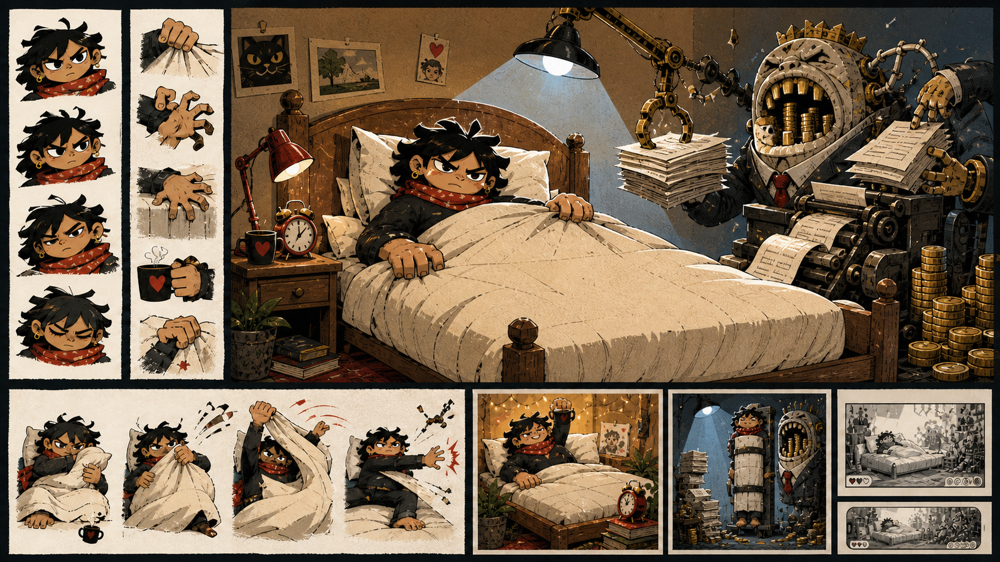

# Third production concept sheet: moderated first direction

Status: exploratory visual research; not production-approved or integrated



## Purpose

This third sheet returns to the [first concept sheet](first-production-concept-sheet.md)
as its direct visual reference after the [second line-art sheet](second-production-concept-sheet.md)
was rejected. It attempts a narrow moderation: preserve the first protagonist,
graphic energy and grotesque Management while reducing the number of machines,
executives and competing environmental details.

## Provenance

- Generated: 14 August 2026
- Tool: OpenAI built-in image generation
- Input reference: `../art/concepts/the-monday-uprising-concept-sheet-v1.png`
- Source image: `../art/concepts/the-monday-uprising-concept-sheet-v3-moderated.png`
- Origin: AI-generated exploratory edit
- Production status: not approved
- Human edits: none; first unedited output from the targeted return to sheet one
- Intended next step: maintainer comparison before any further iteration

## Prompt

```text
Use case: style-transfer
Asset type: third exploratory concept sheet for a 2D political-satire rhythm game; visual research only, not a production game asset
Input images: Image 1 is the preferred first concept sheet and the visual baseline. Preserve its protagonist’s gender-ambiguous design, bold stylised proportions, dark tousled hair, expressive defiant face, strong graphic hands, warm scarf/neck detail, heroic horizontal posture, cut-paper editorial energy and overall political confidence. Preserve Management as a genuinely grotesque systemic capitalist presence.
Primary request: Create a moderated third version of the same concept sheet. Return closely to Image 1, but tone down only the cinematic spectacle, environmental density, quantity of machines and crowd of tiny executives. Make the central joke read faster and give the hero and bed more breathing room. This must remain boldly stylised political cartooning—not realistic, not genteel, and not a 1950s children’s-adventure illustration.
Scene/backdrop: the same warm defended bedroom, still visibly domestic and desirable. One grotesque Management presence intrudes from above and the right through a smaller number of highly legible elements: one acquisitive mechanical arm, overfilled files and contracts, coin-fed administrative machinery, a clock and hard work light. Remove the army, giant battlefield feeling, conveyor-tank clutter and most background cranes.
Subject: preserve the Image 1 hero’s visual identity and gender ambiguity very closely. Keep the hero broad, horizontal, compact, stubborn, heroic and emotionally vivid, with the same kind of expressive face and powerful duvet and mattress grips. Management should remain more grotesque than human: an original maw-like corporate apparatus fused with one absurd executive presence, grasping hands, paperwork and accumulation. It should be funny, repulsive and dangerous without resembling a politician, celebrity or real person.
Style/medium: original bold editorial cartoon with radical-print and satirical-poster energy; expressive ink contours, flat graphic masses, imperfect cut-paper edges, selective rough print texture, limited colour, strong caricatural distortion. Slightly more line-led and spacious than Image 1 but retain its graphic exaggeration, depth and personality. Do not become naturalistic illustration. Do not imitate any particular artist or existing artwork.
Composition/framing: keep a cohesive landscape concept-sheet structure: dominant central bedroom confrontation; a small set of face/gaze and grip studies; one victory thumbnail; one forced-verticalisation thumbnail preserving dignity; desktop and mobile landscape crop studies. Reduce decorative panels and clutter. Head of bed remains on the right.
Lighting/mood: heroic, warm, defiant, satirical and dramatic, but no longer apocalyptic. Management’s cold light invades one portion of the room rather than turning the whole image into a battle scene.
Color palette: preserve Image 1’s duvet cream, ink charcoal, resistance red, work-light blue, management gold and paper white. Use flatter areas and more visible paper. The duvet must be plain cream with folds and patches only.
Constraints: preserve the protagonist from Image 1 rather than redesigning them; hero remains the moral and visual centre; bed is a defended horizontal stronghold; duvet coverage remains readable; silhouettes read small; forms suggest separable cut-out layers and pivots; Management remains dramatically grotesque.
Avoid: do not retain the circular red emblem or any symbol on the duvet; no logo, flag, brand, slogan, generated label, signature or watermark; no recognisable politician or public figure; no orange-skinned person; no realistic adult portrait; no polished 1950s illustration; no Famous Five feeling; no photorealism; no anime gloss; no generic superhero; no childlike redesign; no fat-person stereotype as the main joke; no polite ordinary businessman; no army of executives; no giant industrial battlefield; no restraint straps; no humiliation of the hero.
```

## Initial source-level observations

This draft successfully:

- restores the preferred first protagonist's gender ambiguity, expression,
  proportions and graphic personality;
- removes the unrequested duvet emblem;
- keeps Management grotesque, inhuman and systemically associated with coins,
  paperwork, appetite and machinery;
- reduces the crowd and makes the central bedroom confrontation faster to read;
  and
- preserves warm domestic desirability against a bounded area of cold work
  light.

Unresolved choices remain:

- the rendering is still dense and painterly rather than substantially more
  line-led;
- the hero may still read young and needs deliberate age review;
- Management's crown-like top risks importing monarchy as an unexamined symbol;
- the small forced-verticalisation panel again shows the player strapped
  upright despite the explicit prohibition, so that image is rejected and must
  not guide the production outcome;
- coins communicate accumulation clearly but could become a simplistic visual
  shorthand if not balanced by contracts, hierarchy and coercion; and
- apparent layer separability still requires deliberate production design.

These are source observations awaiting human comparison, not perceptual
acceptance.
